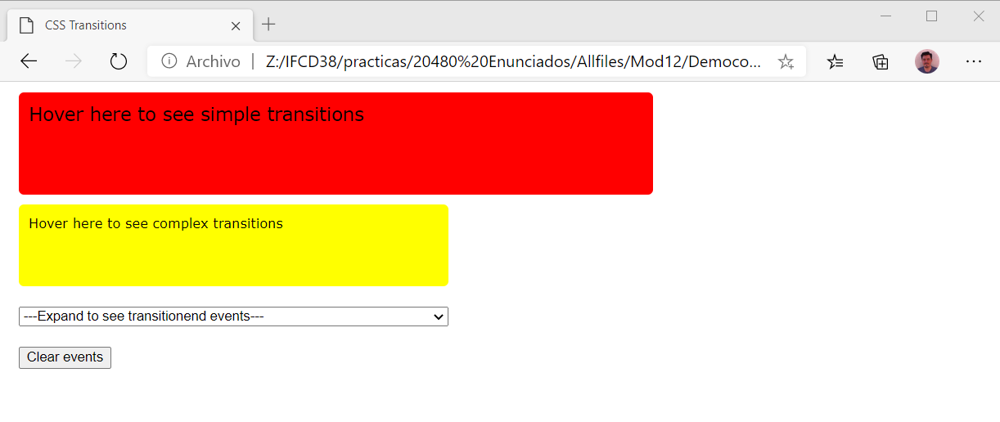
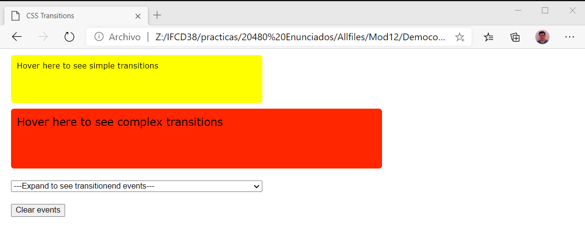
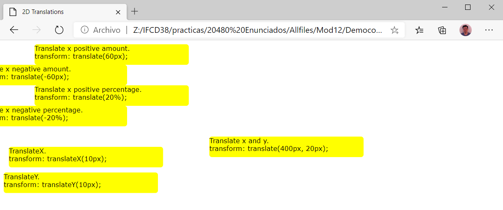
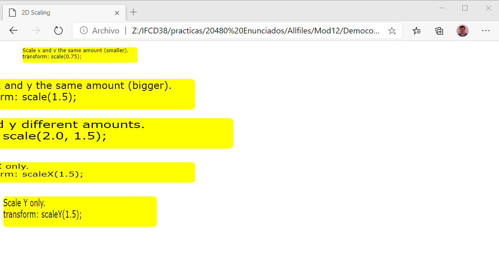
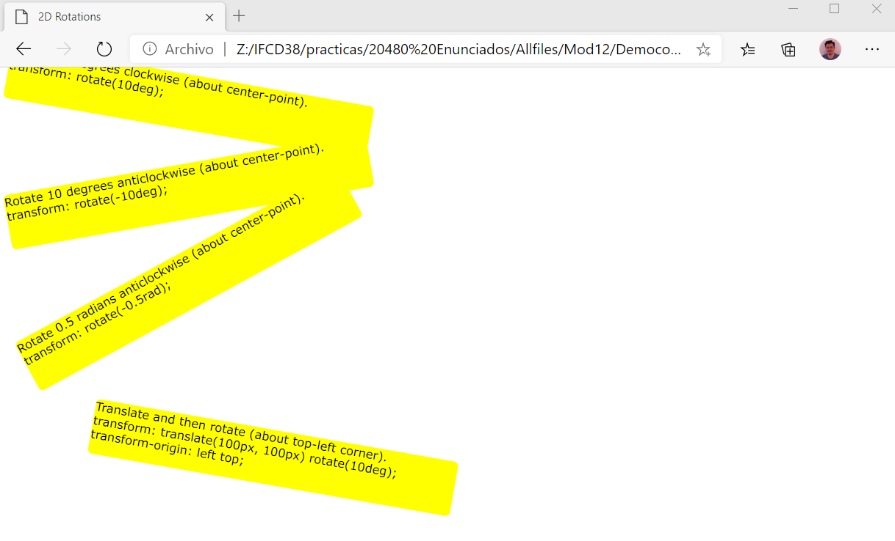
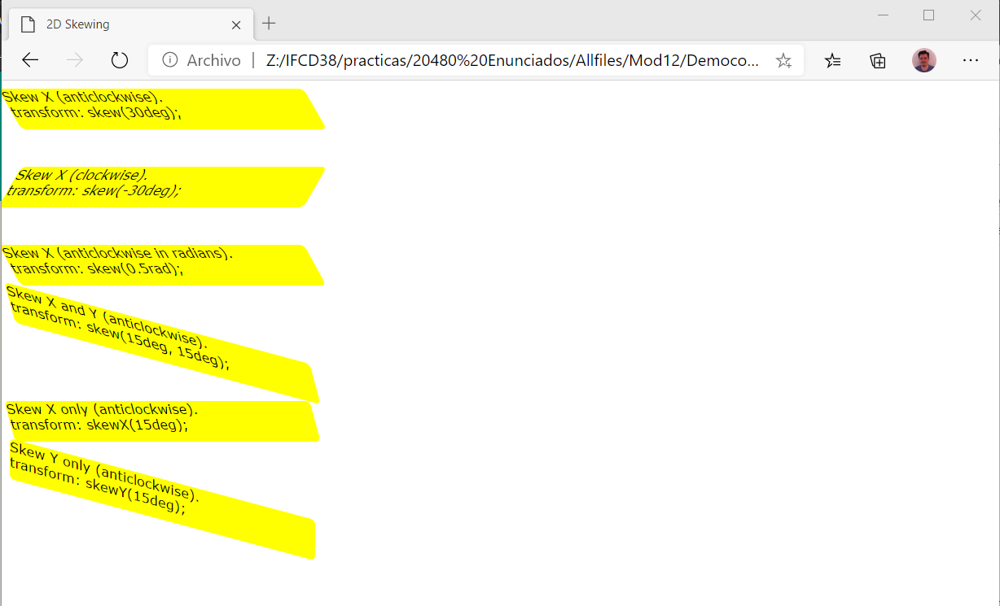
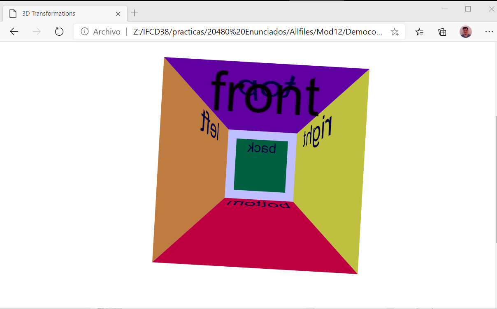
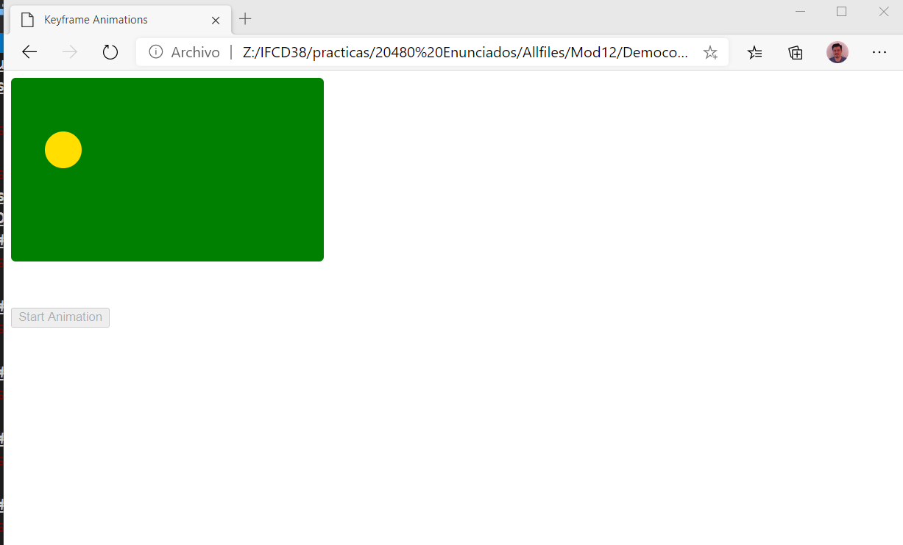

# Module 12: Animating the User Interface
## Lesson 1: Applying CSS Transitions
Place the mouse pointer over the upper rectangle on the web page.

Place the mouse pointer over the second rectangle on the web page.

## Lesson 2: Transforming Elements
#### Demonstration: Performing 2D Transformations
###### Perform 2D Translations

###### Perform 2D Scaling Transformations

###### Perform 2D Rotations

###### Perform 2D Skewing Transformations

###### Performing 3D Transformations

## Lesson 3: Applying CSS Keyframe Animations
#### Implementing Keyframe Animations
