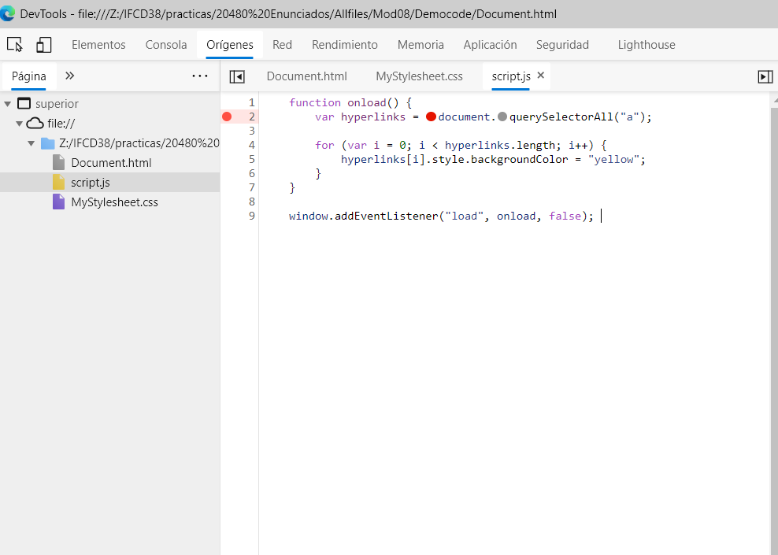
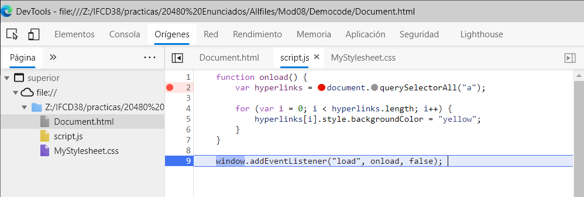
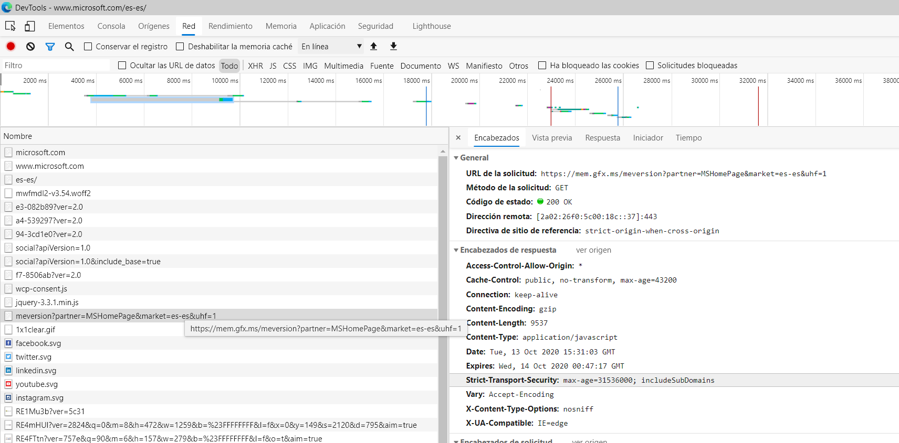
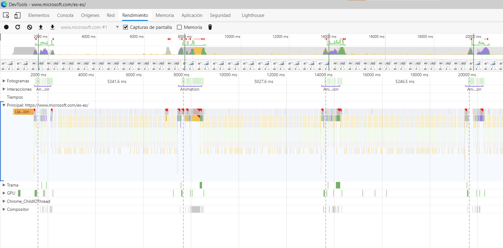

# Module 8: Creating Interactive Pages by Using HTML5 APIs

# Lesson 4: Debugging and Profiling a Web Application

#### Pantallazo creación punto interrupción:

#### Ejecución pausa en punto interrupción:

#### Examine the Network Traffic for a Web Application

#### Capture Profile Data for a Web Application

